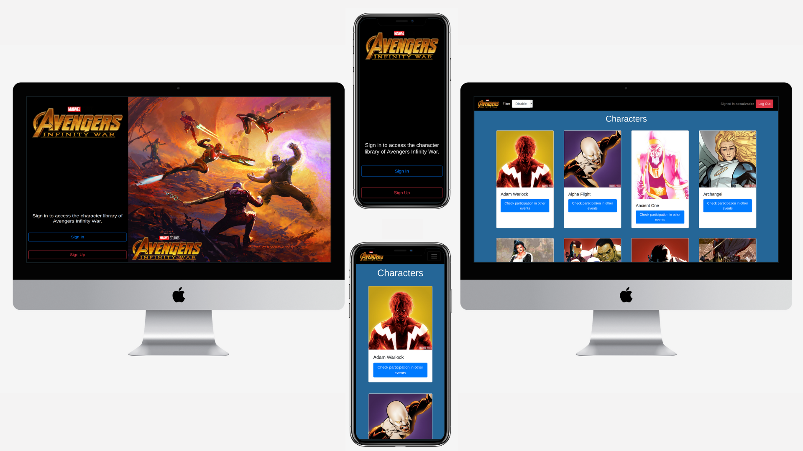

# Marvel Infinity War Characters Library

Where you can check all the characters that participated in this event and see in what other events they participated.

The project was developed using Ruby on Rails with React-Redux and Marvel API to fetch the characters' data.



# Live Version

[Live demo](https://infinity-war-library.herokuapp.com)

# What it does

- The users need to be logged int the app to reviews the different characters.
- The user can filter the result by the name of the character.
- The filter is saved on the user account.
- When a user clicks on each character's button. The user can see in which other events the character participated and can go to the official marvel website to check all the comics of that character.

# Future Features

- Users will be able to select their favorite characters.

- Users will be able to pĺay memory games with the characters' cards.

- Development of error screen component to show a message when something went wrong with the server communication.


# How to run locally this project

- Install Ruby 2.6.5.
- Install Ruby on Rails 5.2.4.
- Instal npm
- Register at (Marvel Developer program)[https://developer.marvel.com/]
- Create an application.yml file inside config folder
- Add in file application.yml PUKEY: Your public key
- Add in file application.yml PRKEY: Your private key
- Run npm instal
- Run "bundle install" inside the downloaded folder.
- Run "rails server" inside folder.
- Go to http://127.0.0.1:3000/


## Test-driven development RSPEC

The code includes unit testing using RSpec. To start the test run the next line in your terminal:

```
bundle exec rspec
```

## Author

**Salvador Olvera**
- Linkedin: [Salvador Olvera](https://www.linkedin.com/in/salvador-olvera-n)
- Github: [@Salvador-ON](https://github.com/Salvador-ON)
- Twitter: [@Salvador Olvera_ON](https://twitter.com/Salvador_ON) 


## Contributing

This is a project for exhibition purposes only. We are not accepting contributions.

## Show your support

Give a ⭐️ if you like this project!

## Enjoy!
